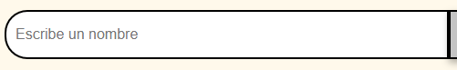
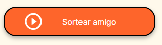
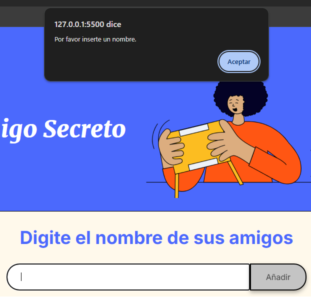
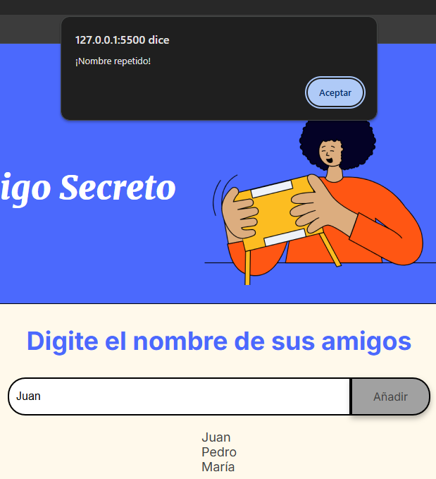
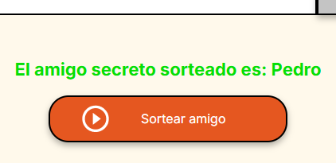
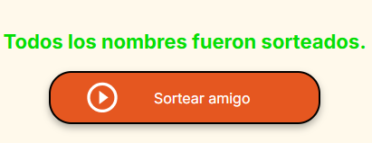
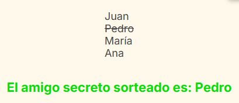

# Challenge Amigo Secreto
<p>Esta aplicación web es una realización del desafío del curso "Principiante en Programación G8 - ONE" de Alura LATAM</p>

## ¿Qué hace?
Esta aplicación sortea un amigo de una lista de nombres ingresados.

## ¿Cómo funciona?
1. Se ingresa un nombre en la caja de texto.<br>
   <br><br>
2. Se presiona la tecla "Enter" o el botón "Añadir".<br>
   <br><br>
3. Una vez terminados de escribir los nombres, se debe hacer clic en el botón "Sortear amigo".<br>
   <br><br>

## Características
- No se puede añadir solo espacios en blanco.<br>
   <br><br>
- No se pueden repetir nombres.<br>
   <br><br>
- Al pulsar el botón "Sortear amigo" se deja de mostrar la lista de nombres añadidos.<br>
   <br><br>
- El botón "Sortear amigo" podrá sortear amigos hasta que salgan todos.<br>
   <br><br>
- Aquellos nombres que ya han salido sorteados aparecerán tachados al ingresar nuevos nombres.<br>
   <br><br>

## Tecnologías Utilizadas
- <span>HTML</span>
- <span>CSS</span>
- <span>JavaScript</span>

## Instalación
1. Clona este repositorio:
   ```bash
   git clone https://github.com/DescansandoShh/challenge-amigo-secreto.git
2. Abre el archivo index.html
   
